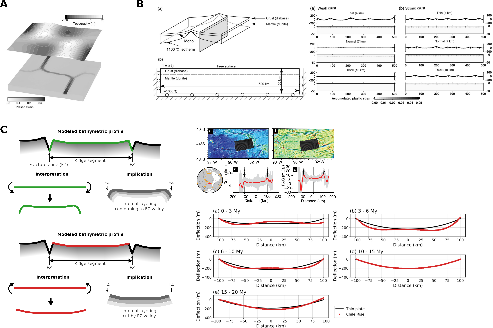

The main goal of this project is to understand how thermal expansion and contraction rocks experience as they go through temperature changes influence tectonic processes such as faulting and bending of oceanic lithosphere and determination of the geometry of mid-ocean ridges. Related topics that have yet to be explored include differential thermal expansion of subducted slab, thermal contraction during the formation of oceanic and continental core complexes, and the formation of other geological structures involving significant temperature change.

**A**. Ridge-parallel thermal contraction can explain the orthogonal intersection between a ridge segment and fracture zones [(Choi et al., PEPI, 2008)](https://echoi.github.io/uploads/%20Choi_etal_EPSL_2008_Thermomechanics.pdf). **B**. Ridge-parallel thermal stress arising in a ridge segment that cannot freely contract can induce normal faulting, leading to segmentation of the ridge [(Choi and Gurnis, EPSL, 2008)](https://echoi.github.io/uploads/ChoiGurnis_EPSL_2008_FractureZones.pdf). **C**. Ridge-parallel thermal contraction in a fracture zone-bounded ridge segment can cause slight upward-concave bending of the elastic portion of the lithosphere, which is consistent with the observations from some selected ridge systems [(Choi and Tominaga, GRL, 2023)](https://agupubs.onlinelibrary.wiley.com/doi/10.1029/2023GL103511).
